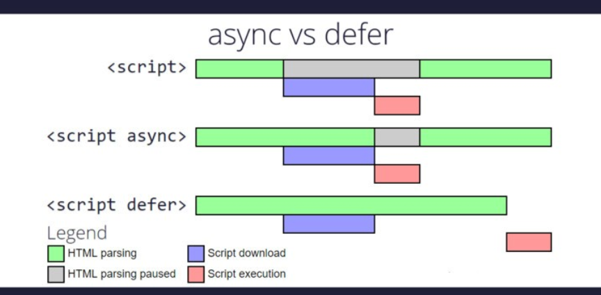

# Learning-React
Used for learning react in 2024.

02/05/2024: ✅

Emmet: Plugin used by many editors to automate your code. (Emmet Abbreviations)
Library & Framework: React is a JavaScript Library.libraries target a specific functionality, while a framework tries to provide everything required to develop a complete application.
CDN Links usage: CDNs speed up content delivery by -- Decreasing the distance between where content is stored and where it needs to go. Reducing file sizes to increase load speed. Optimizing server infrastructure to respond to user requests more quickly.
React? because it is meant to help developers build user interfaces that are fast and responsive, or “reactive.”
Crossorigin in script tag: The crossorigin attribute, valid on the <audio>, , <link>, <script>, and <video> elements, provides support for CORS, defining how the element handles cross-origin requests, thereby enabling the configuration of the CORS requests for the element's fetched data.
React vs ReactDOM: React provides the tools and concepts to define component-based user interfaces, ReactDOM handles the task of rendering those interfaces in a web environment.
Development vs Production modes: 
react.development.js - More developer friendly, readable, will take more size.
react.production.js - Minified code that is not developer friendly as it focused on decreasing in file size, code efficiency.CDN is the Content Delivery Network that provides you with the respective JS file online.
Async & Defer?

Learning arrow functions: makes code shorter and simpler.
const greetings = name => {
  console.log(`Hello, ${name}!`);
};

greetings('John'); // Hello, John!
